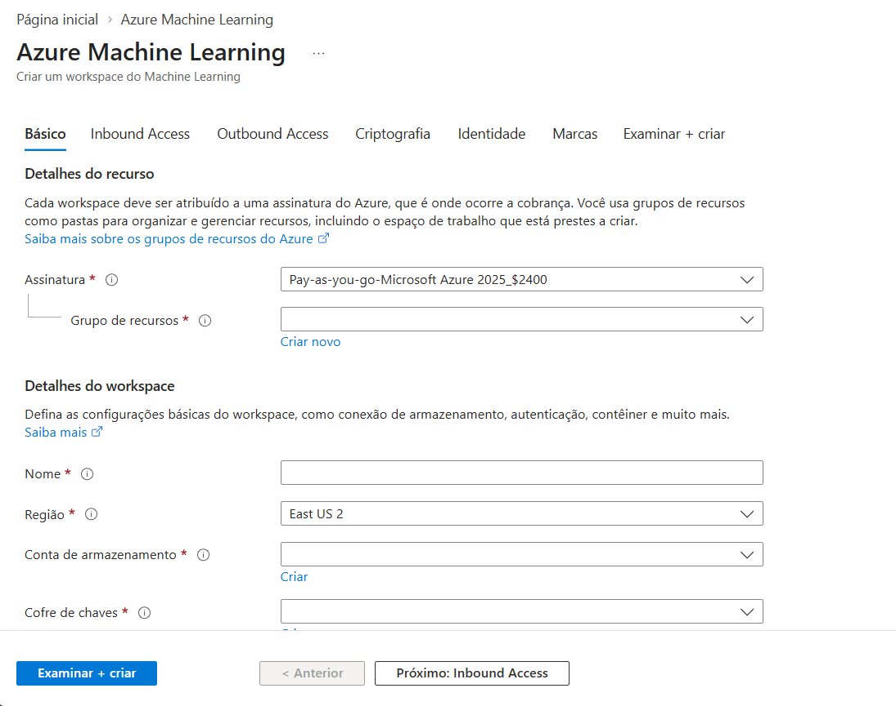
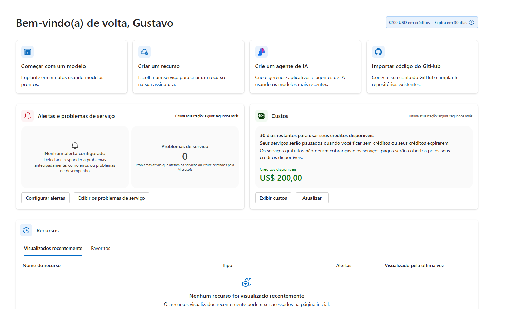
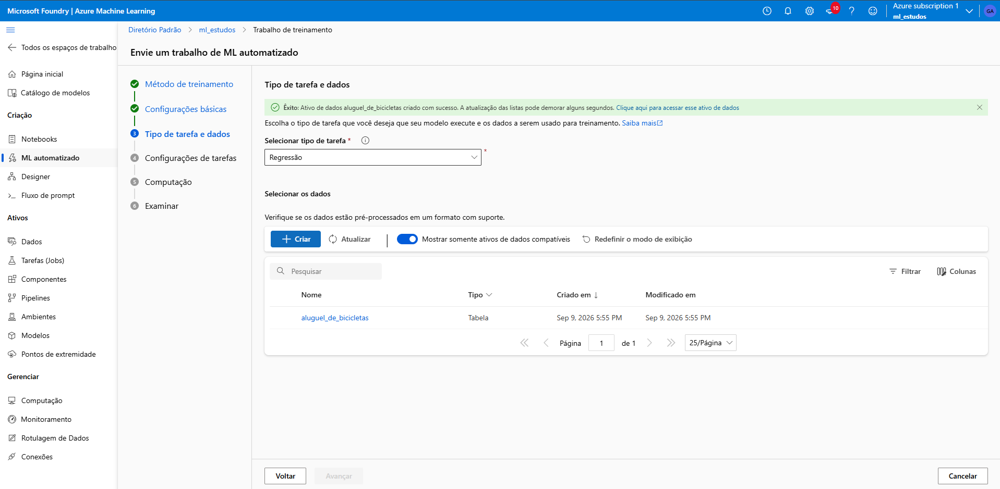
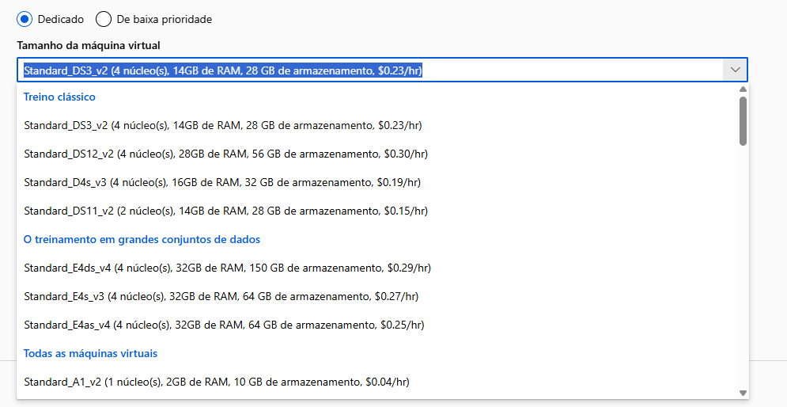
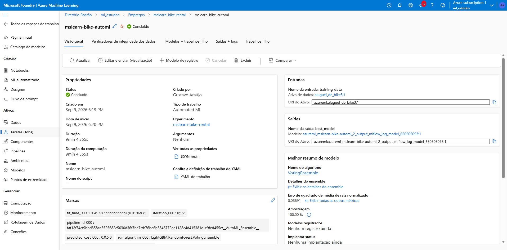

# Projeto DIO - Azure Machine Learning com Automated ML

## Objetivo

O objetivo deste projeto foi explorar os recursos do Azure Machine Learning utilizando o Automated ML (Machine Learning Automatizado) para criar um modelo de previsão baseado em um conjunto de dados reais. Durante o laboratório foi possível compreender as principais etapas do ciclo de vida de um projeto de Machine Learning, desde a importação dos dados até a publicação do modelo treinado.

---

# Tecnologias Utilizadas

- Microsoft Azure
- Azure Machine Learning Studio
- Automated ML (AutoML)
- Azure Compute Cluster
- GitHub

---

# Etapas Realizadas

## 1. Criação do Workspace

Foi criado um Workspace no Azure Machine Learning para centralizar os recursos utilizados durante o projeto.

O Workspace é responsável por armazenar:

- Conjuntos de dados
- Experimentos
- Modelos treinados
- Recursos computacionais
- Endpoints

---

## 2. Importação do Dataset

Foi utilizado o dataset Bike Rentals, disponibilizado pela Microsoft.

Esse conjunto de dados contém informações relacionadas a:

- Estação do ano
- Ano
- Mês
- Dia da semana
- Temperatura
- Sensação térmica
- Umidade
- Velocidade do vento
- Quantidade de bicicletas alugadas

---

## 3. Configuração do Automated ML

Foi criado um experimento utilizando o Automated ML.

O objetivo da previsão foi estimar a quantidade de aluguéis de bicicletas com base nos dados históricos.

### Tipo de tarefa configurada:

```text
Regressão
```

A regressão é utilizada quando desejamos prever valores numéricos.

---

## 4. Configuração dos Recursos Computacionais

Para executar o treinamento foi criado um Compute Cluster.

### Configurações utilizadas:

```text
Máquina Virtual: Standard_DS3_v2

Nós mínimos: 0

Nós máximos: 1
```

Essa configuração permite reduzir o consumo de recursos, desligando automaticamente o cluster quando não estiver sendo utilizado.

---

## 5. Treinamento do Modelo

O Azure Machine Learning avaliou automaticamente diferentes algoritmos e configurações para identificar o modelo com melhor desempenho.

Durante essa etapa a plataforma:

- Analisou os dados históricos
- Identificou padrões
- Testou múltiplos algoritmos
- Comparou métricas de desempenho
- Selecionou automaticamente o melhor modelo

---

## 6. Implantação

Após a conclusão do treinamento, o modelo treinado foi disponibilizado através de um endpoint.

Esse endpoint pode ser consumido por aplicações externas para realizar previsões em tempo real.

---

# Como o Modelo Aprendeu

O modelo foi treinado utilizando registros históricos de aluguel de bicicletas.

A partir desses dados, o Azure Machine Learning identificou relações entre as variáveis de entrada e o resultado esperado.

### Exemplos de padrões aprendidos:

- Dias com temperaturas mais agradáveis tendem a apresentar maior número de aluguéis.
- Dias com condições climáticas desfavoráveis tendem a reduzir a demanda.
- Determinados períodos do ano apresentam padrões previsíveis de utilização.

Após identificar esses padrões, o modelo passou a ser capaz de realizar previsões para novas situações não presentes no conjunto de treinamento.

---

# Conceitos Aprendidos

## Machine Learning

Processo no qual computadores aprendem padrões a partir de dados sem serem programados explicitamente para cada situação.

## Dataset

Conjunto de dados utilizado para treinamento e validação do modelo.

## Regressão

Técnica de Machine Learning utilizada para prever valores numéricos.

### Exemplos:

- Previsão de vendas
- Previsão de temperatura
- Previsão de demanda
- Previsão de aluguel de bicicletas

## Treinamento

Processo no qual o algoritmo analisa os dados históricos para aprender padrões e comportamentos.

## Modelo

Resultado final do treinamento, contendo o conhecimento adquirido a partir dos dados.

## Endpoint

Serviço disponibilizado para que outras aplicações possam utilizar o modelo treinado.

## Azure Machine Learning

Plataforma da Microsoft para criação, treinamento, gerenciamento e implantação de modelos de Inteligência Artificial.

---

# Desafios Encontrados

Durante a execução do laboratório foram encontrados alguns desafios que contribuíram para ampliar o entendimento da plataforma.

## Importação dos Dados

Foi necessário validar corretamente a estrutura do dataset para garantir que os dados fossem reconhecidos e processados corretamente pelo Azure Machine Learning.

## Seleção da Coluna de Destino

Durante a configuração do experimento foi necessário compreender quais informações seriam utilizadas como entrada e qual coluna representaria o valor que o modelo deveria prever.

## Configuração do Ambiente

Outro desafio foi compreender a função dos recursos computacionais necessários para treinamento dos modelos, além de configurar adequadamente o cluster para utilização eficiente dos recursos disponíveis.

---

# Evidências

## Criação do WorkSpace


## WorkSpace Criado


## Configuração do Automated ML


## Configuração do Compute Cluster


## Treinamento do Modelo


---

# Conclusão

Este projeto permitiu compreender na prática como funciona o processo de criação de soluções baseadas em Machine Learning utilizando o Azure Machine Learning.

Além de aprender sobre conceitos fundamentais de Inteligência Artificial, foi possível explorar recursos como Workspace, AutoML, treinamento automatizado, avaliação de modelos, provisionamento de recursos computacionais e publicação de endpoints para consumo por aplicações externas.

A experiência demonstrou como o Azure simplifica o desenvolvimento de soluções de Machine Learning, permitindo a criação de modelos preditivos mesmo sem a necessidade de desenvolver algoritmos manualmente.
