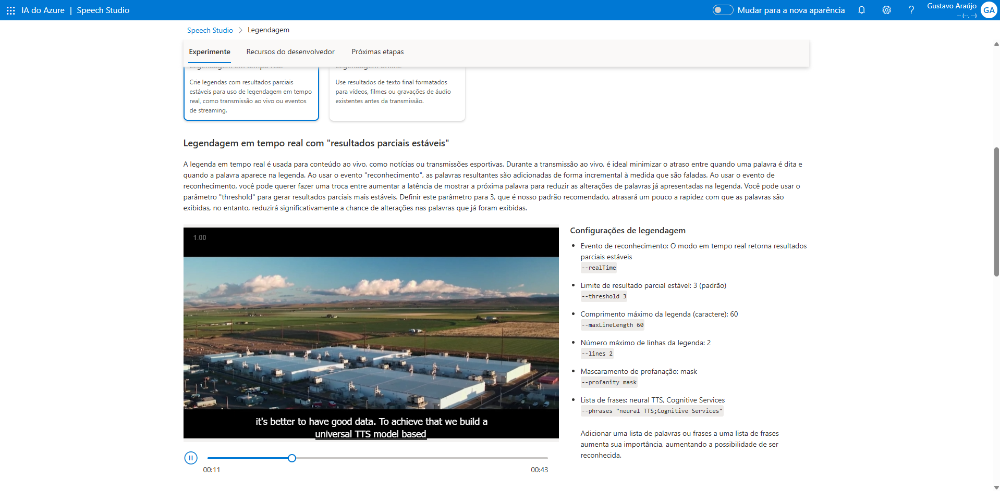
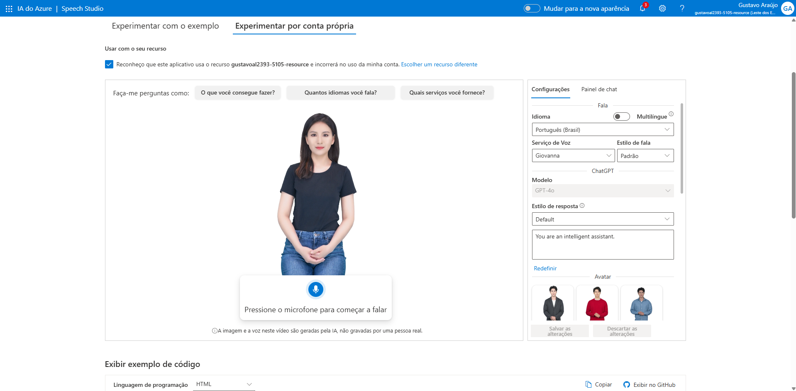

# Projeto DIO - Azure Speech Studio e Language Studio

## Objetivo

Este projeto foi desenvolvido como parte do desafio prático da DIO com o objetivo de explorar os recursos de processamento de fala e linguagem natural disponibilizados pelo Microsoft Azure.

O laboratório teve como foco o estudo das funcionalidades do Azure Speech Studio e do Azure Language Studio, compreendendo como essas ferramentas podem ser utilizadas para criar soluções inteligentes baseadas em voz, texto e Inteligência Artificial.

---

# Tecnologias Utilizadas

- Microsoft Azure
- Azure Speech Studio
- Azure Language Studio
- Azure AI Services
- Processamento de Linguagem Natural (NLP)
- Speech Services
- Git
- GitHub

---

# Etapas Realizadas

## 1. Estudo do Azure Speech Studio

Foi realizada a exploração dos recursos disponíveis no Azure Speech Studio, plataforma responsável pelos serviços relacionados ao processamento de voz.

Durante essa etapa foi possível compreender funcionalidades como:

- Conversão de fala em texto (Speech to Text)
- Conversão de texto em fala (Text to Speech)
- Reconhecimento automático de fala
- Personalização de vozes
- Tradução baseada em fala

---

## 2. Estudo do Azure Language Studio

Foi realizada a análise dos recursos disponíveis no Azure Language Studio, ferramenta voltada para o processamento de linguagem natural.

Durante a exploração foram estudadas funcionalidades como:

- Análise de sentimentos
- Extração de frases-chave
- Detecção de idioma
- Identificação de entidades nomeadas
- Classificação de textos

---

## 3. Compreensão dos Serviços de IA

O laboratório permitiu entender como os serviços de fala e linguagem podem ser integrados a aplicações modernas.

Entre os cenários estudados destacam-se:

- Assistentes virtuais
- Chatbots inteligentes
- Transcrição automática de reuniões
- Atendimento automatizado
- Análise de opiniões e feedbacks
- Sistemas de acessibilidade

---

## 4. Documentação da Experiência

Como parte do desafio, foi realizada a documentação dos conceitos estudados, registrando os principais aprendizados e possibilidades de aplicação das ferramentas Azure Speech Studio e Language Studio.

A utilização do GitHub permitiu organizar o conhecimento adquirido e criar uma base de consulta para estudos futuros.

---

# Aprendizados

Durante a realização deste projeto foi possível aprender:

- Como funcionam os serviços de fala da Microsoft.
- Como realizar a conversão de voz em texto.
- Como gerar voz a partir de textos utilizando IA.
- Os conceitos básicos de Processamento de Linguagem Natural (NLP).
- Como a Inteligência Artificial pode analisar sentimentos em textos.
- Como identificar palavras-chave automaticamente.
- A importância da IA para acessibilidade e automação.
- Como os serviços Azure podem ser integrados a aplicações corporativas.
- A utilização do GitHub para organização e documentação técnica.

---

# Conceitos Aprendidos

## Speech to Text

Tecnologia que permite converter fala em texto de forma automática.

### Exemplos:

- Transcrição de reuniões
- Legendas automáticas
- Assistentes virtuais
- Atendimento por voz

## Text to Speech

Tecnologia responsável por transformar textos em voz sintetizada.

### Exemplos:

- Leitura automática de documentos
- Assistentes de voz
- Sistemas de acessibilidade
- Atendimento automatizado

## Processamento de Linguagem Natural (NLP)

Área da Inteligência Artificial responsável por permitir que computadores compreendam, interpretem e processem a linguagem humana.

## Análise de Sentimentos

Recurso que permite identificar opiniões, emoções e percepções em textos.

### Aplicações:

- Pesquisa de satisfação
- Monitoramento de redes sociais
- Avaliação de feedbacks de clientes

## Extração de Frases-Chave

Processo utilizado para identificar os termos mais importantes presentes em um texto.

## Detecção de Idioma

Recurso capaz de identificar automaticamente o idioma utilizado em um conteúdo textual.

## Azure Speech Studio

Serviço da Microsoft voltado para soluções baseadas em reconhecimento e síntese de voz.

## Azure Language Studio

Serviço da Microsoft voltado para análise de texto e processamento de linguagem natural.

---

# Possíveis Aplicações

Os recursos estudados podem ser utilizados em diversos cenários, incluindo:

- Assistentes virtuais inteligentes.
- Chatbots corporativos.
- Centrais de atendimento automatizadas.
- Sistemas de acessibilidade.
- Transcrição automática de reuniões.
- Análise automática de feedbacks de clientes.
- Monitoramento de redes sociais.
- Tradução e interpretação de conteúdo.
- Automação de processos baseados em voz e texto.

---

# Desafios Encontrados

Durante a realização do laboratório foi possível perceber a constante evolução dos serviços de Inteligência Artificial da Microsoft.

Algumas funcionalidades e interfaces podem sofrer alterações ao longo do tempo devido às atualizações da plataforma Azure AI.

Além disso, compreender a grande quantidade de recursos disponíveis nos serviços de fala e linguagem exige estudo contínuo, já que cada funcionalidade possui diferentes possibilidades de aplicação no mercado.

Mesmo assim, o laboratório proporcionou uma excelente visão geral sobre as capacidades de processamento de voz e linguagem natural oferecidas pelo Azure.

---

# Evidências

# Conclusão

Este projeto contribuiu para o entendimento dos serviços Azure Speech Studio e Azure Language Studio, permitindo conhecer os conceitos fundamentais relacionados ao processamento de voz e linguagem natural.

Além do aprendizado técnico sobre Inteligência Artificial, o desafio reforçou a importância da documentação, da organização do conhecimento e da utilização do GitHub como ferramenta para compartilhamento de experiências e projetos tecnológicos.

A experiência demonstrou como os serviços de IA da Microsoft podem ser utilizados para criar soluções modernas, acessíveis e capazes de compreender tanto a fala quanto a linguagem humana de forma inteligente.
